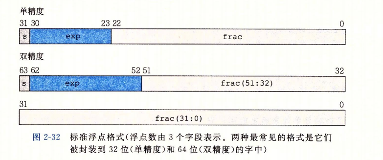
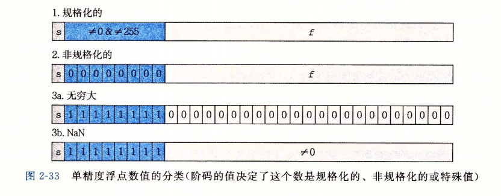

# 《深入理解计算机系统》第2章 信息的表示与处理 讲义

## 2-1信息的存储  
大多数计算机使用由8比特位组成的**字节** ,作为最小的可寻址的内存单位。  
操作系统提供的**虚拟内存** （以下简称内存）机制，可以让机器级程序将内存视为一个非常大的字节数据。内存的每个字节都有一个唯一的数字标识。该数字称为内存的**地址** ，所有可能地址的集合就称为**虚拟地址空间** 。内存可存放不同的**程序对象** ，即数据、指令和控制信息。  
每台计算机都有一个**字长（word size）** ，它是字的位数，同时指明指针数据的**标称大小（normal size）**。字长决定最重要的系统参数就是虚拟地址空间的最大大小。对于一个字长为$w$位的机器而言，虚拟地址的范围为$0\sim 2^w-1$，即程序最多访问$2^w$个字节.大多数64位的机器也可以运行32位机器编译的程序，这是一种向后兼容。  
对于跨越多个字节的程序对象，我们需要考虑它的地址与字节的排列顺序。其中对象的地址为所使用字节中最小的地址。多字节对象都被存储为连续的字节序列，但是某些机器按照最低有效字节到最高有效字节的顺序存储对象，这种方式成为**小端法** ；相对的，按照最高有效字节到最低有效字节的顺序存储对象，这种方式成为**大端法** 。大多数Intel兼容机都只用小端模式，而IBM和Oracle的大多数机器是大端模式，比较新的微处理器是**双端法** ，一旦选择了特定的操作系统，那么字节顺序也就被固定下来。

----
## 2-2信息的表示  
首先对以下符号做出约定  
|  符号   | 含义  |
|  :--:  | :--:  |
| $B2T_{w}$  | 二进制转补码 |
| $B2U_{w}$  | 二进制转无符号数 |
| $U2B_{w}$  | 无符号数转二进制 |
| $U2T_{w}$  |  无符号数转补码|
| $T2B_{w}$  |  补码转二进制|
| $T2U_{w}$  |  补码转无符号数|
| $TMin_{w}$  |  最小补码值|
| $TMax_{w}$  |  最大补码值|
| $UMax_{w}$  |  最大无符号值|
| $+^{t}_{w}$  |  补码加法|
| $+^{u}_{w}$  |  无符号数加法|
| $*^{t}_{w}$  |  补码乘法|
| $*^{u}_{w}$  |  无符号数乘法|
| $-^{t}_{w}$  |  补码取反|
| $-^{u}_{w}$  |  无符号数取反|  

注意到$TMin_{w} = - TMax_{w} - 1$,这种特性称为**不对称性** 。

-----

**无符号数的编码**   
对于向量$\vec{x}=[x_{w-1},x_{w-2}, \dots,x_0]$:
$$ B2U_w(\vec{x}) = \sum_{i=0}^{w-1}x_i2^i$$

**补码编码**  
对于向量$\vec{x}=[x_{w-1},x_{w-2}, \dots,x_0]$:
$$ B2T_w(\vec{x}) = -x_{w-1}2^{w-1} + \sum_{i=0}^{w-2}x_i2^i $$

**浮点数编码**   
首先介绍二进制小数。  
考虑一个以二进制表示的小数：$b_{m}b_{m-1}...b_{1}b_{0}.b_{-1}b_{-2}...b_{-n+1}b_{-n}$。则其对应的十进制小数$d$为: $d = \sum_{i=-n}^{m}2^{i}*b_{i}$。     

浮点数对形如$V=x*2^y$的有理数进行编码，大多数浮点数编码遵循**IEEE754标准** 。   
IEEE浮点标准用$V=(-1)^s*M*2^E$的形式来近似表示一个数：
- **符号s** 表示这个数是正数还是负数，其编码用一个单独的符号位s。
- **尾数M** 表示一个二进制小数，其编码用n位小数字段$frac=f_{n-1}f_{n-2} \dots f_{1}f_{0}$。
- **阶码E** 表示对浮点数加权，权重为2的E次幂，其编码用k位的阶码字段$exp=e_{k-1}e_{k-2}\dots e_{1}e_{0}$

   
  

对浮点值的解释
- **规格化的值**     
当exp的位模式不全为0或1时，该浮点值为规格化的值。  
阶码字段exp被解释为以偏置形式表示的有符号整数$E$，即$E=e-Bias$，其中e为无符号整数，e的位模式就是$exp=e_{k-1}e_{k-2}\dots e_{1}e_{0}$，而$Bias=2^{k-1}-1$.  
小数字段frac被解释为描述小数值$f$,其中$0 \leq f < 1$,其二进制表示为$0.f_{n-1}f_{n-2}\dots f_{0}$。而尾数$M$被定义为$M=1+f$  

- **非规格化的值**  
当阶码字段exp的位模式全为0时，该浮点值为非规格化的值。  
非规格化的数提供一种表示数值0的方法，同时也提供了称为逐渐下溢的属性，可表示非常接近于0.0的数。
此时$E=1-Bias$, $M=f$。其中这样设置偏置值是因为可以实现最大非规格化数到最小规格化数的平滑转变。

- **特殊值**  
当阶码字段exp的位模式全为1时，该浮点值为特殊值。  
当小数字段frac的位模式全是0时，表示无穷，当$s=0$时是$+\infty$,当$s=1$时是$-\infty$。同时无穷表示溢出的结果。  
当小数字段frac的位模式不全是0时，表示NaN,即这不是一个数。   

 

浮点数是对实数$x$的近似表示，因此采用“舍入”的系统方法，找到最接近的匹配值$x'$,并且能用浮点数表示。
IEEE定义了四种不同的舍入方式，分别是：
- 向偶数舍入（默认方式）
- 向零舍入
- 向下舍入
- 向上舍入

其他的三种方式产生实际值的确界。向零舍入可避免统计偏差。

-----
**补码转换为无符号数**  
对于满足$TMax_{w} \leq x \leq TMax_{w}$的$x$有:
$$
    T2U_{w}(x) = 
    \begin{cases}
        x+2^{w}, &x < 0\\
        x, &x \geq 0
    \end{cases}
$$
**推导如下**  
我们注意到
$$ 
    \begin{aligned}
        B2U_{w}(\vec{x})-B2T_{w}(\vec{x}) 
        &= \sum_{i=0}^{w-1}-\left(-2^{w-1}x_{w-1}+\sum_{i=0}^{w-2}x_i2^i\right)\\ 
        &= 2^wx_{w-1}
    \end{aligned} 
$$
即 
$$
    B2U_{w}(\vec{x}) = B2T_{w}(\vec{x}) + 2^wx_{w-1}
$$
因此
$$
    \begin{aligned}
    T2U_{w}(x) &= B2U_{w}(T2B_{w}(x)) \\
        &= B2T_{w}(T2B_{w}(x)) + 2^{w}x_{w-1}\\
        &= x + 2^{w}x_{w-1}
    \end{aligned}
$$
综上
$$
    T2U_{w}(x) = 
    \begin{cases}
        x+2^{w}, &x < 0\\
        x, &x \geq 0
    \end{cases}
$$
----

**无符号数转换为补码**  
对于满足$0\leq u \leq UMax_{w}的u$有  
$$
    U2T_{w}(u)=
    \begin{cases}
        u, \quad &u \leq TMax_{w}\\
        u-2^w, \quad &u > TMax_{w}
    \end{cases}
$$
**推导如下**  
我们注意到
$$ 
    \begin{aligned}
        B2U_{w}(\vec{x})-B2T_{w}(\vec{x}) 
        &= \sum_{i=0}^{w-1}-\left(-2^{w-1}x_{w-1}+\sum_{i=0}^{w-2}x_i2^i\right)\\ 
        &= 2^wx_{w-1}
    \end{aligned} 
$$
即 
$$
    B2T_{w}(\vec{x}) = B2U_{w}(\vec{x}) - 2^wx_{w-1}
$$
因此
$$
    \begin{aligned}
        U2T_{w}(u) &= B2T_{w}(U2B_{w}(u))\\
        &=B2U_{w}\left(U2B_{w}(u)\right)-2^{w}x_{w-1}\\
        &=u-2^wx_{w-1}
    \end{aligned}
$$
综上
$$
    U2T_{w}(u)=
    \begin{cases}
    	u, \quad &u \leq TMax_{w}\\
        u-2^w, \quad &u > TMax_{w}
    \end{cases}
$$
----
**无符号数的零扩展**   
定义宽度为$w$的位向量$\vec{u}=[u_{w-1},u_{w-2},\dots,u_{0}]$和定义宽度为$w'$的位向量$\vec{u'}=[0,0,\dots,0,u_{w-1},u_{w-2},\dots,u_{0}]$,其中$w'>w$。则$B2U_{w}(\vec{u}) = B2U_{w'}(\vec{u'})$  
证明略

----
**补码数的符号扩展**
定义宽度为$w$的位向量$\vec{x}=[x_{w-1},x_{w-2},\dots,x_{0}]$和定义宽度为$w'$的位向量$\vec{x'}=[x_{w-1},x_{w-1},\dots,x_{w-1},x_{w-1},x_{w-2},\dots,x_{0}]$,其中$w'>w$。则$B2U_{w}(\vec{x}) = B2U_{w'}(\vec{x'})$    

**推导如下**  
首先考虑$w'=w+1$的情况
$$
    \begin{aligned}
        B2T_{w+1}([x_{w-1},x_{w-1},x_{w-2},\dots,x_{0}]) 
        &= -2_{w}x_{w-1} +\sum_{i=0}^{w-1}2^{i}x_{i}\\
        &=-2^{w}x_{w-1}+2^{w-1}x_{w-1}+\sum_{i=0}^{w-2}2^ix_{i}\\
        &=-2^{w-1}+\sum_{i=0}^{w-2}x_{i}2^{i}\\
        &=B2T_{w}([x_{w-1},x_{w-2},\dots,x_{0}])
    \end{aligned}
$$
归纳后，可得更一般的情况即
$$
    B2U_{w}(\vec{x}) = B2U_{w'}(\vec{x'})\qquad(w'>w)
$$ 

----
**截断无符号数**    
令$\vec{x}$等于位向量$[x_{w-1},x_{w-2},\dots,x_{0}]$,而$\vec{x}'$是将其截断为k位的结果：$\vec{x}'=[x_{k-1},x_{k-2},\dots,x_{0}]$。令$x=B2U_{w}(\vec{x}),x'=B2U_{k}(\vec{x}')$。则$x'=x\quad mod\quad 2^k$  
**推导如下**  
我们不难得出以下结论
$$
    2^{i}mod2^{k}=0, \quad (i \geq k)
$$
所以
$$
    \begin{aligned}
        B2U_{w}([x_{w-1},x_{w-2},\dots,x_{0}]) mod 2^{k} 
        &= \left[\sum_{i=0}^{w-1}x_{i}2^{i} \right] mod 2^{k}\\
        &= \sum_{i=0}^{k-1}x_{i}2^{i}\\
        &= B2U_{k}([x_{k-1},x_{k-2},\dots,x_{0}])
    \end{aligned}
$$

----
**截断补码数值**   
令$\vec{x}$等于位向量$[x_{w-1},x_{w-2},\dots,x_{0}]$,而$\vec{x}'$是将其截断为k位的结果：$\vec{x}'=[x_{k-1},x_{k-2},\dots,x_{0}]$ 。令$x=B2U_{w}(\vec{x})$。令$x=B2U_{w}(\vec{x}),x'=B2U_{k}(\vec{x}')$。则$x'=U2T_{k}(xmod2^{k})$

-----
**无符号数加法**  

对满足$0 \leq x,y<2^w$的$x$与$y$有：
$$
    x+^{u}_{w}y=
    \begin{cases}
        x+y, &x+y<2^{w}\\
        x+y-2^{w}, &2^{w} \leq x+y < 2^{w+1}
    \end{cases}
$$

---
**无符号数乘法**  
对满足$0 \leq x, y \leq UMax_{w}$的$x$和$y$有：
$$
    x *_{w}^{u} y = (x*y)mod2^{w}
$$

----
**无符号数的非**  
对满足$0 \leq x,y<2^w$的任意$x$,其$w$位的无符号逆元$-_{w}^{u}x$由下式给出：
$$
    -_{w}^{u}=
    \begin{cases}
        x, &x=0\\
        2^{w}-x, &x>0
    \end{cases}
$$

----
**补码的加法**  
对满足$-2^{w-1} \leq x,y \leq 2^{w-1}-1$的$x$与$y$有：
$$
    x+^{u}_{w}y=
    \begin{cases}
        x+y-2^{w}, &2^{w-1} \leq x+y\\
        x+y,  &-2^{w-1} \leq x,y < 2^{w-1}\\
        x+y+2^{w},  &x+y<-2^{w-1}
    \end{cases}
$$
推导如下：  
补码的加法有着以下关系：
$$
    \begin{aligned}
        x+^{t}_{w}y 
        &= U2T_{w}(T2U_{w}(x)+^{u}_{w}T2U_{w}(y))\\
        &= U2T_{w}[(2^{w}x_{w-1}+x+2^{w}y_{w-1}+y)mod2^{w}]\\
        &= U2T_{w}[(x+y)mod2^{w}]
    \end{aligned}
$$  

接着分四种情况讨论  
1）当$x+y$满足$-2^{w} \leq x+y < -2^{w-1}$的情况时。有$(x+y)mod2^{w} = x+y+2^{w}$。而$0 \leq x+y+2^{w} < -2^{w-1}+2^{w}=2^{w-1}$。考虑$U2T_{w}(x)$的定义。则$x+^{t}_{w}y=U2T_{w}[(x+y)mod2^{w}]= x+y+2^{w}$  
2）当$x+y$满足$-2^{w-1} \leq x+y < 0$的情况时。我们由第一情况得：$(x+y)mod2^{w} = x+y+2^{w}$。而$-2^{w-1}+2^{w} \leq x+y+2^{w} < 2^{w}$。考虑$U2T_{w}(x)$的定义。则$x+^{t}_{w}y=U2T_{w}[(x+y)mod2^{w}]= x+y+2^{w}-2^{w}=x+y$  
3)当$x+y$满足$0 \leq x+y < 2^{w-1}$的情况时。有$(x+y)mod2^{w}=x+y$。而$0 \leq x+y < 2^{w-1}$。考虑$U2T_{w}(x)$的定义。则$x+^{t}_{w}y=U2T_{w}[(x+y)mod2^{w}]= x+y$  
4）当$x+y$满足$2^{w-1} \leq x+y < 2^{w}$的情况时。有$(x+y)mod2^{w}=x+y$,而$2^{w-1} \leq x+y-2^{w} <2^{w}$。考虑$U2T_{w}(x)$的定义。则$x+^{t}_{w}y=U2T_{w}[(x+y)mod2^{w}]=x+y-2^{w}$  
综上，得出  
$$
    x+^{u}_{w}y=
    \begin{cases}
        x+y-2^{w}, &2^{w-1} \leq x+y\\
        x+y,  &-2^{w-1} \leq x,y < 2^{w-1}\\
        x+y+2^{w},  &x+y<-2^{w-1}
    \end{cases}
$$

这里有些小可爱就可能会问为什么先$T2U_{w}(x)$,即先把补码转换为无符号数。这是因为，在汇编中补码与无符号数有着相同的位级行为。

----
**补码的乘法**  
对满足$TMin_{w} \leq x, y \leq TMax_{w}$的$x$和$y$有：
$$
    x *_{w}^{t} y = U2T_{2}((x*y)mod2^{w})
$$

-----
**补码的非**  
对满足$TMin_{w} \leq x, y \leq TMax_{w}$,其补码的非$-^{t}_{w}x$由下式给出
$$
    -^{t}_{w}x=
    \begin{cases}
        TMin_{w}, & x = TMin_{x}\\
        -x, x>TMin_{x}
    \end{cases}
$$

------
**无符号和补码的位级等价性**   
给定长度为$w$的位向量$\vec{x}$和$\vec{y}$,用补码形式的位向量表示来定义整数$x$和$y$：$x=B2T_{w}(\vec{x}), y = B2T_{w}(\vec{y})$。用无符号形式的位向量表示来定义非负整数$x'$和$y'$：$x'=B2U_{w}(\vec{x}), y' = B2U_{w}(\vec{y})$。则
$$
    T2B_{w}(x*_{w}^{t}y) = U2B_{w}(x'*_{w}^{u}y')
$$
**推导如下**  
显然我们有
$$
    x' = B2U_{w}(T2B_{w}(x)) = x + x_{w-1}*2^{w}\\
    y' =  B2U_{w}(T2B_{w}(y)) = y + y_{w-1}*2^{w}
$$
故
$$
    \begin{aligned}
        (x'*y')mod2^{w} &= [(x+x_{w-1}*2^{w})*(y+y_{w-1}*2^{w})]mod2^{w}\\
            &=[x*y+(x_{w-1}y+y_{w-1}x)2^{w}+x_{w-1}y_{w-1}2^{2w}]mod2^{w}\\
            &=(x*y)mod2^{w}
    \end{aligned}
$$
结合无符号乘法以及补码乘法的定义得  
$$
    \begin{aligned}
        T2U_{w}(x*^{t}_{w}y) &=T2U_{w}(U2T_{w}((x*y)mod2^{w}))\\
            &=(x*y)mod2^{w}\\
            &=(x'*y')mod2^{w}\\
            &=x'*^{u}_{w}y‘
    \end{aligned}
$$

对等式两边应用$U2B_{w}(x)$得
$$
    \begin{aligned}
        U2B_{w}(T2U_{w}(x*^{t}_{w}y)) &= T2B_{w}(x*^{t}_{2}y)\\
        &= U2B_{w}(x'*^{u}_{w}y')
    \end{aligned}
$$
-----
**左移——乘以2的幂**  
设$x$为位模式$[x_{w-1},x_{w-2},...,x_{0}]$表示的无符号整数。那么向左移$k$位所得到的$x^{'}$，满足$x^{'}=x*2^{k}$，此时要考虑溢出的影响。  
**推导如下**
$$   
    \begin{aligned}
        B2U_{w+k}([x_{w-1},x_{w-2},...,x_{0},0,...,0]) 
        &= \sum^{w-1}_{i=0}x_{i}*2^{i + k}\\
        &= \left[\sum^{w-1}_{i=0}x_{i}*2^{i} \right] * 2^{k}\\
        &= x*2^{k}
    \end{aligned}
    
$$
而高$k$位被丢弃，得到
$$
    [x_{w-k-1},x_{w-k-2},...,x_{0},0,...,0]
$$
此时考虑溢出的影响。  
由于整数的乘法比移位和加法的代价要大得多，所以C语言编译器试图以移位、加法和减法的组合来优化整数乘以常数的情况。一般有两种形式
- $(x << n) + (x << (n - 1)) + ... + (x << m)$
- $(x << (n + 1)) - (x << m)$

--------
**右移-除以2的幂**    
首先先引入一些符号。对于任何实数$a$，定义$\lfloor a \rfloor$为唯一的整数$a^{'}$，使得$a^{'} \leq a < a^{'} + 1$。对于任何实数$a$，定义$\lceil a \rceil$为唯一的整数$a^{'}$，使得$a^{'} - 1 < a \leq a^{'}$。     
C变量$x$和$k$有无符号数值$x$和$k$。且$0 \leq k < w$，则C表达式x >> k 产生数值$\lfloor x / 2 ^ {k} \rfloor$。  
**推导如下**  
设$x$为位模式$[[x_{w-1},x_{w-2},...,x_{0}]$表示的无符号整数，而$k$的取值范围为$0 \leq k < w$。设$x'$为$w-k$位，表示为
$[x_{w-1},x_{w-2},...,x_{k}]$的无符号数；而$x''$为$k$位，表示为$[x_{w-1},x_{w-2},...,x_{0}$的无符号数。显然有$x=2^{k}x'+x''$,而$0 \leq x'' < x^{k}$。因此可得$\lfloor x / 2^{k} \rfloor = x'$.

补码也类似。但对于负数来说，向下舍入是种不合理的舍入。我们可以引入“偏置值”来修正这种不合理的舍入。   
偏置技术利用如下属性，对于整数$x$和$y(y > 0)$，$\lceil x/y \rceil = \lfloor (x + y - 1) / y \rfloor$。  
**推导如下**  
假设$x = qy + r$,其中$0 \leq r < y$。则考察$\lceil x/y \rceil$，有
$$

    \lceil x/y \rceil = q + \lceil r/y \rceil = 
    \begin{cases}
        q,&r = 0\\
        q + 1, &r > 0
    \end{cases}
$$
接着考察$\lfloor (x + y - 1) / y \rfloor$,有
$$
    \lfloor (x + y - 1) / y \rfloor = q + \lfloor (r + y - 1) / y \rfloor =
    \begin{cases}
        q,&r = 0\\
        q + 1, &r > 0
    \end{cases}
$$
故有$\lceil x/y \rceil = \lfloor (x + y - 1) / y \rfloor$。

-------
**浮点数的运算**  
浮点的加法不满足结合律 ，但满足交换律。 
浮点的乘法在加法上不满足分配律  
浮点加法与乘法满足严格的单调性属性  

**整数的运算**  
整数的加法形成了阿贝尔群  
其中阿贝尔群同时具有以下性质
- 具有封闭性
- 满足交换律
- 满足结合律
- 有着唯一的幺元
- 集合中的每个元素都有唯一的逆元

整数的加法不满足严格的单调性属性

## C语言

### 位级运算
C语言支持按位布尔运算。‘|’表示或，‘&’表示与，‘~’表示取反，‘^’表示异或。**掩码运算**是一个常见的位级运算，所谓的掩码就是一个位模式，表示从一个字中选出的位的集合。位级运算的部分真值表如下：
|^|0|1|
|:--:|:--:|:--:|
|0|0|1|
|1|1|0|

### 移位运算
C语言还支持移位运算。‘<<’表示左移k位，并丢弃最高的k位，在数学意义上来说，左移k位等价于乘$2^{k}$。‘>>’表示右移k位，一般而言，机器支持两种形式的右移：**逻辑右移**与**算术右移**。逻辑右移就是在左端补k个零，而算数右移是在左端补k个最高有效位的值。对于无符号数，右移必须是逻辑的。而对于有符号数，C语言标准并未做出规定，但是一般来说是算术右移。注意对于由$w$位组成的数据，移动$k \ge w$时，一般机器只会考虑位移量的低$log_2w$位，实际上就是位移量就是通过计算$k mod w$得到的，不过对于这种行为C语言是没有保证的。