# 《深入理解计算机系统》第3章 程序的机械级表示 讲义

## 汇编语言（x86体系， AT&T）  
对于底层来说，汇编语言建立了一种关于它的抽象模型，以隐藏逻辑电路实现的具体细节。该抽象模型为**指令集体系结构（Instruction Set Architecture）** ，又称**指令集架构** 。其定义了机器级程序的格式和行为，同时定义了处理器状态、指令格式，以及每条指令对状态的影响。  
  
在汇编语言的视角下，一些硬件对其可见：
- 程序计数器（Programme Counter），存储将要执行下一条指令的地址。用%rip表示。
- 整数寄存器文件（通用目的寄存器），这些寄存器按照约定，扮演不同的角色。如图所示  
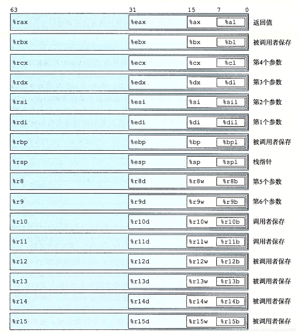  

- 条件码寄存器,它们描述了最近的算术或逻辑操作的属性。最常用的条件码为
    - CF：进位标志。最近的操作使最高位产生了进位
    - ZF：零标志。最近的操作得出的结果为0
    - SF：符号标志。最近的操作得到的结果为负数
    - OF：溢出标志。最近的操作导致一个补码溢出 
 
算数与逻辑指令类会隐式设置条件码，而CMP、TEST指令类会显式设置条件码。  

- 向量寄存器，这些寄存器按照约定，扮演不同的角色，如图所示  
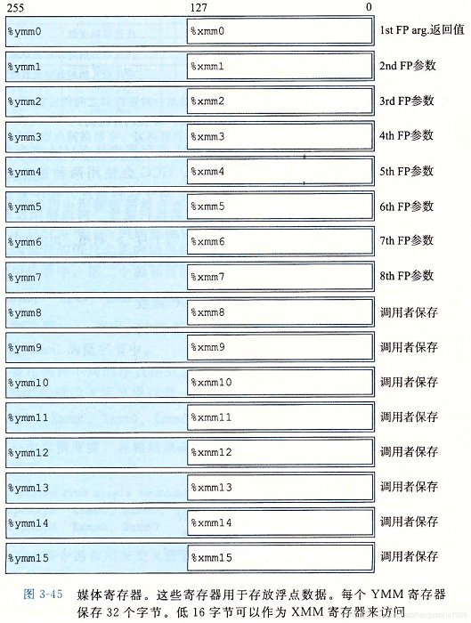

-----
### **数据类型**
|Intel数据类型|汇编代码后缀|大小（字节）|
|:--:|:--:|:--:|
|字节|b|1|
|字|w|2|
|双字|l|4|
|四字|q|8|
|单精度|s|4|
|双精度|l|8|
注意，汇编代码并不会将程序值与C语言中的数据类型联系起来，也就是说，对于某一条汇编指令，C语言中的补码与无符号数有着相同的位级行为。

-----
### **操作数指示符**
大多数指令有一个或多个**操作数（operand）** ，不同的操作数可能被分为以下三种类型：
- **立即数（immediate）** ，表示常量值。
- **寄存器（register）** ，表示某个寄存器中的内容。
- **内存引用** ，根据有效地址，访问某个内存地址。
  
其中操作数的格式可总结为以下格式：  
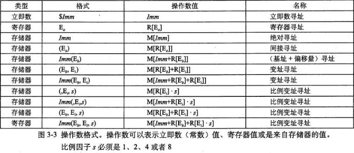  

指令所需的操作数，必须通过寻址去获取。在这里说明一下$Imm(r_{b}, r_{i}, s)$形式的寻址模式。它由四部分组成：一个立即数偏移量$Imm$, 一个基址寄存器$r_{b}$, 一个变址寄存器$r_{i}$和一个比例因子$s$,这里s必须是1、2、4或者8。基址寄存器和变址寄存器必须是64位寄存器。，其有效地址被计算为$Imm+R[r_{b}]+R[r_{i}]*s$

------
### **数据传送指令**  
该指令将数据从一个位置复制到另一个位置。  
**MOV类指令**如下   
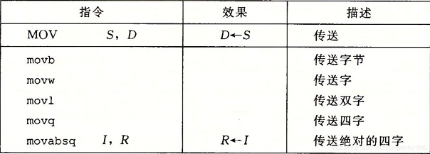  
在这里做几点说明：  
源操作数不做任何限制，而目的操作数是寄存器或者内存。  
两个操作数不能同时是内存。  
寄存器部分大小必须与指令最后一个字符指定的大小匹配。  
movl指令以寄存器作为目的时，它会把该寄存器的高位4个字节设置为0。  

**MOVZ类指令**如下  
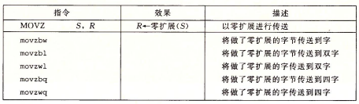  

**MOVS类指令**如下     
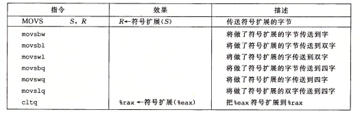   
MOVZ指令与MOVS指令将较小的源值复制到较大的目的值，源操作数是寄存器或内存，而目的操作数是寄存器。

**POP与PUSH指令**如下  
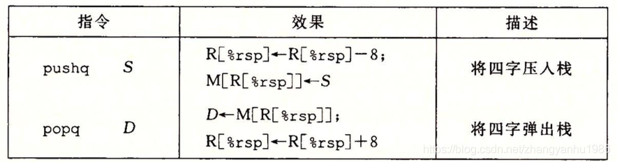  

------
### **算术和逻辑操作**  
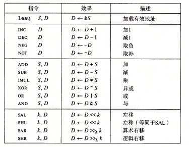  
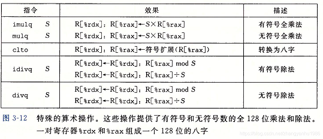  
加载有效地址（load effective address）指令leaq，该指令将有效地址写入到目的操作数，这里的目的操作数必须是一个寄存器。  
一元操作中的操作数，即是源又是目的。这个操作数可以使寄存器，也可以是内存。  
二元操作中，源操作数不做任何限制，而目的操作数是寄存器或者内存。  
移位操作中，源操作数是立即数或者是单字节寄存器%cl，目的操作数可以是寄存器也可以是内存。  
特殊的算数操作中，对128位数的操作提供了有限的支持。
imulq与mulq指令要求第一个参数必须存放在%rax寄存器中，而另一个参数作为指令的操作数给出。其结果存放在寄存器%rdx（高八位）与%rax（低八位）中。  
idivq与divq指令将寄存器%rdx（高八位）与%rax（低八位）作为被除数，而除数作为指令的操作数给出。其商存储在%rax中，余数存储在%rdx中。 对于一个64位的被除数来说，这个值应该存放在%rax中，而寄存器%rdx的所有位在无符号的上下文中设置为0，在补码的上下文中设置为补码的符号位。其中cqto指令可以读出%rax的符号位，并将它复制到%rdx的所有位中。

------
### **控制**
**CMP类指令**与**TEST类指令**来设置条件码
|指令|设置条件码的方式|
|:--:|:--:|
|CMP S1, S2|S2 - S1|
|TEST S1, S2|S2 & S1|  

**SET类指令**  
该指令访问条件码，其目的操作数是单字节寄存器，或一个字节的内存位置   
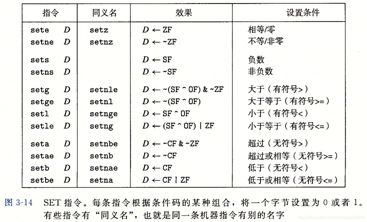    

**条件控制转移 JMP指令**  
该指令会无条件跳转到指定位置。跳转的方式有两种：
- 直接跳转，以给定的标号作为跳转目标的。
- 间接跳转，‘*’后面跟一个操作数指示符。

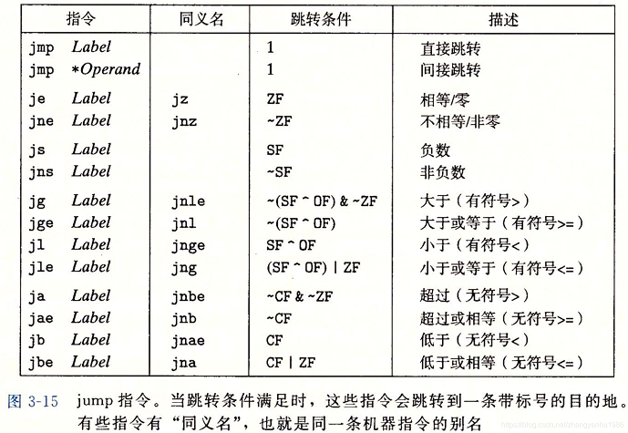  

在这里补充一点，直接跳转中，汇编器会确定所有带标号指令的地址，并将目的指令的地址编码为跳转指令的一部分。在这里有两种常见的编码方式：
- 相对地址，将目的指令的地址与紧跟在JMP类指令后面的那条指令的地址之间的差作为编码。
- 绝对地址，直接指定目的表指令的地址。

**条件数据转送指令**  
该指令在满足条件的情况下，将源值复制到目的寄存器。其中源值从内存或寄存器中读取。  
源操作数与目的操作数可以是16、32、64位的，但不支持单字节的条件传送。汇编器可以从目标寄存器的名字推断出操作数的长度。所以对所有的操作数长度，都可以使用同一个指令的名字。    
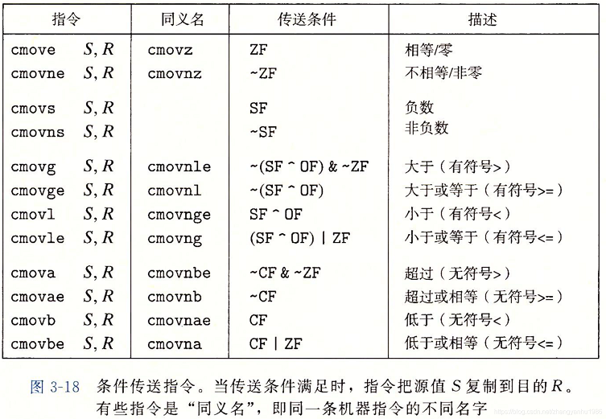  

在这里简略介绍一下处理器的浮点体系结构
### **浮点传送和转换**   
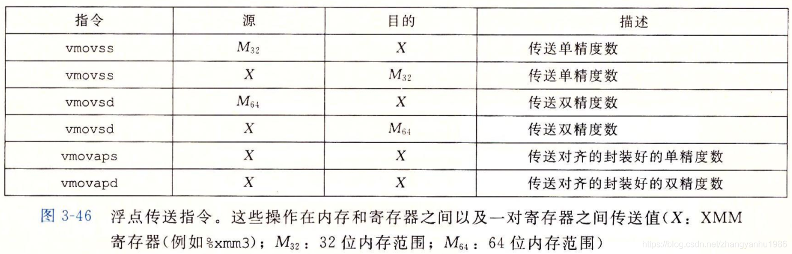   
源或目的操作数为内存时，这些指令为标量指令。

### **浮点和整型之间的转换**
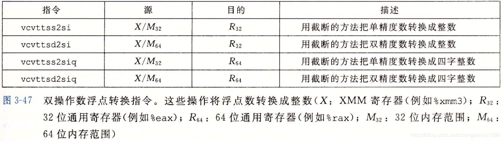  
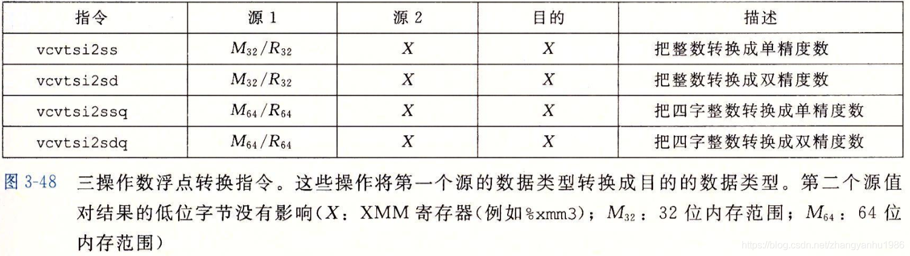  

### **浮点运算操作**  
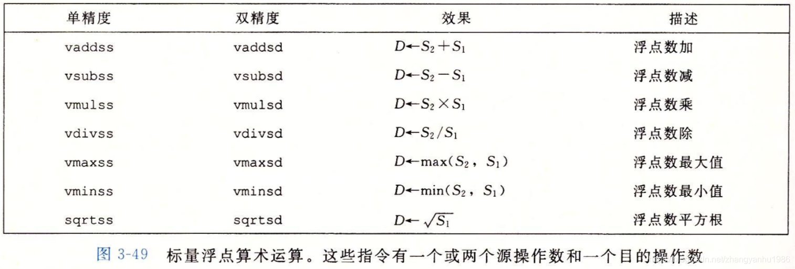  
-------------
## 过程  
在软件中，过程是一种重要的抽象，提供了一种封装代码的方式。可以用一组指定的参数和一个可选的返回值实现了某种行为。这种抽象隐藏了某个行为的具体实现，同时又提供清晰简洁的接口定义。在不同的编程语言中，过程的形式多种多样：function、method、subroutine、handler。过程通常由以下机制实现：
- **转移控制**  
    将程序控制权从函数P转移到函数Q。在汇编层面上通过call、ret指令实现转移控制机制。  
      
    假设地址A为返回地址，即紧跟在call指令后面的那条指令的地址。则call指令将A压入到栈中，并将PC设置为函数Q的起始地址  
    ret指令将返回地址A从栈中弹出，并将PC设置为返回地址A。  
    在变长栈帧中，寄存器%rbp作为帧指针。此时，leave指令将帧指针恢复到他之前的值。
- **数据传送**  
    在x86-64中，可以通过通用寄存器传递6个整型或指令类型的参数。这些寄存器的使用是有特殊顺序的。而超过6个的部分就要通过栈来传递。通过栈传递参数时，所有的数据大小都向8的倍数对齐。
- **局部存储**  
    一般情况下，局部参数存储在寄存器中。而在以下情况中，C语言的局部数据必须存放在内存中。
    - 寄存器不足够存放所有的局部数据
    - 对一个局部变量使用地址运算符
    - 某些局部变量是数组或结构。
这里需要考虑寄存器的使用。寄存器是唯一被所有过程共享的资源。x86-64采用了所有过程必须遵守的惯例，该惯例为寄存器%rbx、%rbp和%r12-%r15被划分为**被调用者保存寄存器** ，被调用的过程有必要责任保存这些寄存器的值。要么不改变这些寄存器，要么将它们压入栈中。所有其他的寄存器，除栈指针%rsp，都被划分为**调用者保存寄存器**。这些寄存器可被任意函数修改。所以在调用之前，保存这些寄存器所存储的值，是调用者的责任。

通常实现过程所使用的数据结构为栈。在栈上分配的空间称为**栈帧（stack frame）** 。而通用的栈帧结构由以下部分组成：
- 被保存的寄存器
- 局部变量
- 参数构造区
- 返回地址
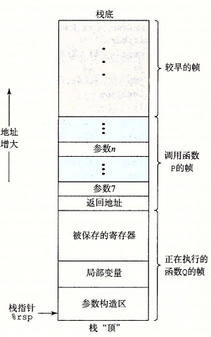

----------

 
